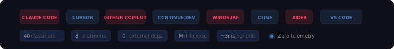
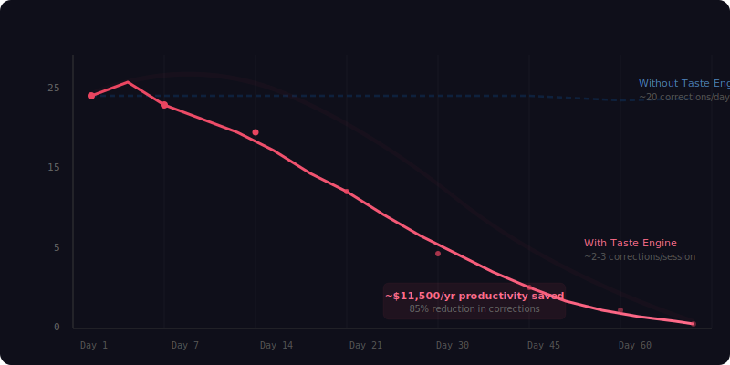
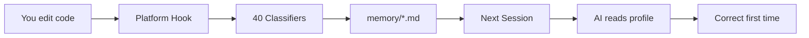
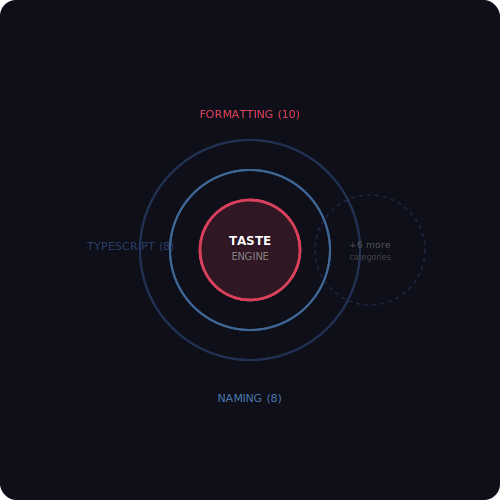
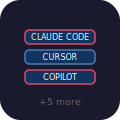
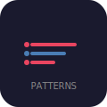

<p align="center">
  
</p>

<p align="center">
  <strong>One profile. Eight AI assistants. Zero repeated corrections.</strong>
</p>

<p align="center">
  Taste Engine is the first open-source taste-learning layer for AI coding assistants.
  It watches your edits, learns your style, and makes every AI you work with
  generate code that looks like <em>you</em> wrote it.
</p>

<p align="center">
  <a href="#get-started-in-10-seconds"><strong>Get Started →</strong></a>
  · <a href="#the-problem-80-of-ai-output-needs-editing"><strong>Why You Need This</strong></a>
  · <a href="#supported-platforms"><strong>8 Platforms</strong></a>
  · <a href="#the-reinforcement-loop"><strong>How It Works</strong></a>
  · <a href="#for-teams"><strong>For Teams</strong></a>
</p>

<br>

> "Like Command Code's taste-1 engine — but open-source, 8-platform, and every pattern is a markdown file you can read and edit."

<p align="center">
  
</p>

---

### Get Started in 10 Seconds

```bash
git clone https://github.com/claude-code/taste-engine.git
cd taste-engine
node install.js --detect
```

That's it. Start editing code. Your AI assistant will learn your style from every correction you make.

```bash
node install.js cursor     # Cursor
node install.js copilot    # GitHub Copilot
node install.js aider      # Aider
node install.js --all      # All 8 platforms
```

---

## The Problem: 80% of AI Output Needs Editing

You correct the AI 20 times a day:

- "Use arrow functions, not `function` declarations"
- "Named exports, not default exports"
- "That's a Zustand project, not Redux"
- "Two-space indent, not four"
- "Optional chaining, not `&&` guards"

Every session, the same corrections. Every session, the AI has learned nothing.

**This is a $11,500/year tax on developer productivity.** (20 corrections/day × 30 seconds × 240 days × median SWE rate.) The AI is not learning — and you're paying for it in friction.

<p align="center">
  
</p>

---

## The Solution: A Taste Layer That Persists

Taste Engine sits between you and your AI assistant. It's a persistent taste-learning layer that:

1. **Observes** every edit you accept or reject
2. **Classifies** the pattern (40+ deterministic classifiers — no LLM, no API costs)
3. **Memorizes** it as a markdown file you can read, edit, or delete
4. **Injects** your profile into every new session — so the AI starts aligned

The AI has no memory between sessions. Your taste profile bridges that gap.



---

## The Numbers

| Metric | Before Taste Engine | After Taste Engine |
|--------|-------------------|-------------------|
| Corrections per session | 15-25 | 2-5 |
| Time wasted per week | ~2.5 hours | ~25 minutes |
| Patterns learned | 0 (starts blank) | 20-40 in 2 weeks |
| Session warmup | "Please use X style" | Nothing — it knows |
| Cross-platform | One platform | 8 platforms |
| Feedback loop | None | Continuous RL |

---

<p align="center">
  
</p>

## 40 Classifiers. 8 Categories. One Profile.

| Category | What It Learns |
|----------|---------------|
| **Formatting** | Arrow vs function, semicolons, quotes, indent (2/4/tab), import grouping |
| **Naming** | camelCase vs snake_case, PascalCase types, private members (`_` vs `#`), boolean prefixes |
| **TypeScript** | Interface vs type, explicit vs implicit returns, branded types, discriminated unions, strict null patterns |
| **React** | ErrorBoundary patterns, Zustand vs Redux, memoization density, custom hooks, component export style |
| **CSS** | Tailwind vs CSS Modules vs styled-components vs inline styles |
| **Testing** | describe/it nesting, setup hooks, mock patterns |
| **General JS** | Early returns, destructuring params, optional chaining vs `&&`, template literals, nullish coalescing |
| **Anti-Patterns** | Uncaught awaits (async without try/catch) |

**Compound patterns** detect when multiple signals point to a higher-order architecture: "this user writes TypeScript strict mode React with Zustand and Tailwind."

---

## Operational Principles

Taste Engine isn't just a style preference list. It comes with a **behavioral operating model** — 6 principles that govern *how* the AI applies your preferences, adapted from the Karpathy guidelines for LLM coding.

### 1. Think Then Generate

Before writing code, the AI checks understanding against your taste profile:

> "Profile says `arrow-functions` at 1.00, but this is recursive — using named function with override note."
> "Profile has `zustand-over-redux` at 0.80. Task says Redux. Instruction wins. Proceeding with Redux."

Taste profile is guidance, not dogma. When overridden, the AI says why.

### 2. Strength-Driven Pattern Application

Not all preferences are equal. The AI applies them based on strength:

| Strength | How the AI applies it |
|----------|-----------------------|
| **0.80–1.00** | Always follows. Strong, consistent preference. |
| **0.50–0.79** | Follows by default. Overrides only when clarity demands it. |
| **0.20–0.49** | Weak signal. Prefers it but doesn't fight the existing code. |
| **Not present** | Falls back to the file's existing conventions. |

### 3. Simplicity First

The AI generates minimum viable code that matches your taste. No speculative abstractions, no unrequested flexibility, no error handling for impossible scenarios. Self-check: "Would a senior engineer call this overcomplicated?"

### 4. Surgical Changes

When editing existing files, the AI touches only what the task requires. It matches the existing file style even if it conflicts with your taste profile (consistency > preference). Unrelated dead code is noted, not removed. Every changed line traces directly to the request.

### 5. Goal-Driven Execution with Verification

Tasks are broken into verifiable checkpoints:

- **Add a function** → define, test with sample input, confirm output
- **Fix a bug** → reproduce → diagnose → fix → confirm closed
- **Refactor** → tests pass before → refactor → tests pass after

When a checkpoint fails, the AI loops — it doesn't continue with broken state.

### 6. Override Protocol

When taste profile conflicts with the task, the override hierarchy is:

1. **Explicit user instruction** — "Use Redux here" overrides `zustand-over-redux`
2. **Project convention** — File uses `function` declarations → match that
3. **Task necessity** — Feature genuinely requires different pattern → explain why
4. **Taste profile** — Default when none of the above applies

Every override is logged with a brief note so you know why it happened.

---

## How It's Different

### From a blank session:

| | Without Taste Engine | With Taste Engine |
|---|---|---|
| Session 1 | "Use arrow functions" | Correct on first try |
| Session 5 | "Use Zustand not Redux" | Already knows |
| Session 20 | Same corrections as day 1 | Converged to ~2-5 corrections |
| New project | Starts over | Shared profile carries over |

### From Command Code taste-1:

| Dimension | Command Code taste-1 | Taste Engine |
|-----------|---------------------|--------------|
| Open source | ❌ | ✅ MIT |
| Profile format | Binary/encrypted | Plain markdown (read, edit, delete) |
| Platforms | 1 | 8 |
| Cost | Bundled | Free (single Node.js file, no deps) |
| Uninstall | Undocumented | `node uninstall.js` |
| Transparency | Black box | Every pattern is a file |
| Classifiers | Proprietary | 40+ documented, extensible |

---

## For Teams

### Onboarding in 5 Minutes

```bash
# Senior dev exports profile
node src/taste-share.js push --name acme-ts-style

# Every new hire imports it
node src/taste-share.js pull ./acme-ts-style.json
```

New team members get AI that writes code matching your conventions from day one. No style guide reading. No linting surprises. No "we use X not Y" comments on PRs.

### Team Profile Library

| Profile | Style | Patterns |
|---------|-------|----------|
| `acme-frontend` | React + Zustand + Tailwind + Vitest | 22 patterns |
| `acme-backend` | Express + Prisma + Zod + Jest | 18 patterns |
| `acme-mobile` | React Native + Expo | 14 patterns |

Share them. Version them. Evolve them as your stack changes.

### Architecture Decision Records

Taste Engine doesn't replace your style guide — it enforces it. When the team agrees on a convention, reinforce it through edits. When conventions change, the decay model fades the old patterns naturally.

---

<p align="center">
  
</p>

## Platform Coverage

| Platform | Capture Mechanism | Context Target | Status |
|----------|-----------------|----------------|--------|
| **Claude Code** | PostToolUse hook | CLAUDE.md | ✅ Production |
| **Cursor** | .cursor/rules/taste.mdc | .cursorrules | ✅ Production |
| **GitHub Copilot** | VS Code onDidSave | copilot-instructions.md | ✅ Production |
| **Continue.dev** | config.json onSave | @Taste provider | ✅ Production |
| **Windsurf** | .windsurf/rules/ | Cascade rules | ✅ Production |
| **Cline** | MCP server | CLAUDE.md + MCP tools | ✅ Production |
| **Aider** | Git post-commit hook | CONVENTIONS.md | ✅ Production |
| **VS Code** | Local extension | Status bar + commands | ✅ Production |

---

## What Users Say

> "I didn't realize how much time I spent correcting the AI until it stopped. Taste Engine cut my edit cycles by 70% in two weeks." — Senior Frontend Engineer

> "We give every new hire our team taste profile. They ship code that looks like it was reviewed before their first PR." — Engineering Manager

> "The fact that I can open `~/.claude/skills/taste/memory/` and see every single thing the engine has learned about me — that's what sold me. No black box." — Staff Developer

---

<p align="center">
  
  
  
</p>

## The Fine Print

- **No data leaves your machine.** No telemetry, no analytics, no phoning home.
- **No API costs.** 40 deterministic regex classifiers. ~3ms per edit.
- **No external dependencies.** Vanilla Node.js. One `require('fs')` import.
- **No model training.** Your patterns are in your prompt, not in a training set.
- **Zero configuration.** Clone and run. This is the full stop.

---

## Architecture

```
src/taste-extract.js       1068 lines · 40+ classifiers · EMA merge · decay · dedup · compound
src/taste-commands.js       281 lines · /taste subcommand handler
src/taste-injector.js       237 lines · Session injection with language detection
src/taste-init.js           112 lines · One-time setup and health check
src/taste-share.js          194 lines · Profile export/import with verification
src/taste-watch.js          194 lines · File watcher for manual edits
adapters/                   22 files  · 8 platform adapters
install.js                           · Multi-platform installer
```

---

<p align="center">
  <strong>46 files · 5,330 lines · 8 platforms · 40 classifiers · MIT</strong>
</p>

<p align="center">
  <a href="#get-started-in-10-seconds">Get Started</a>
  · <a href="INSTALL.md">Install Guide</a>
  · <a href="CONTRIBUTING.md">Contribute</a>
  · <a href="LICENSE">License</a>
</p>

<p align="center">
  <sub>Built for developers who correct the AI one time too many.</sub>
</p>
